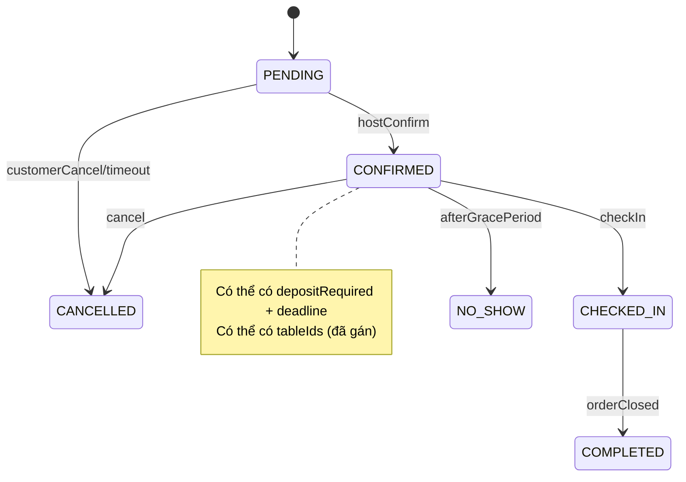
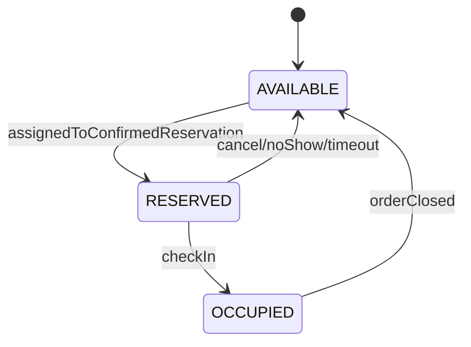
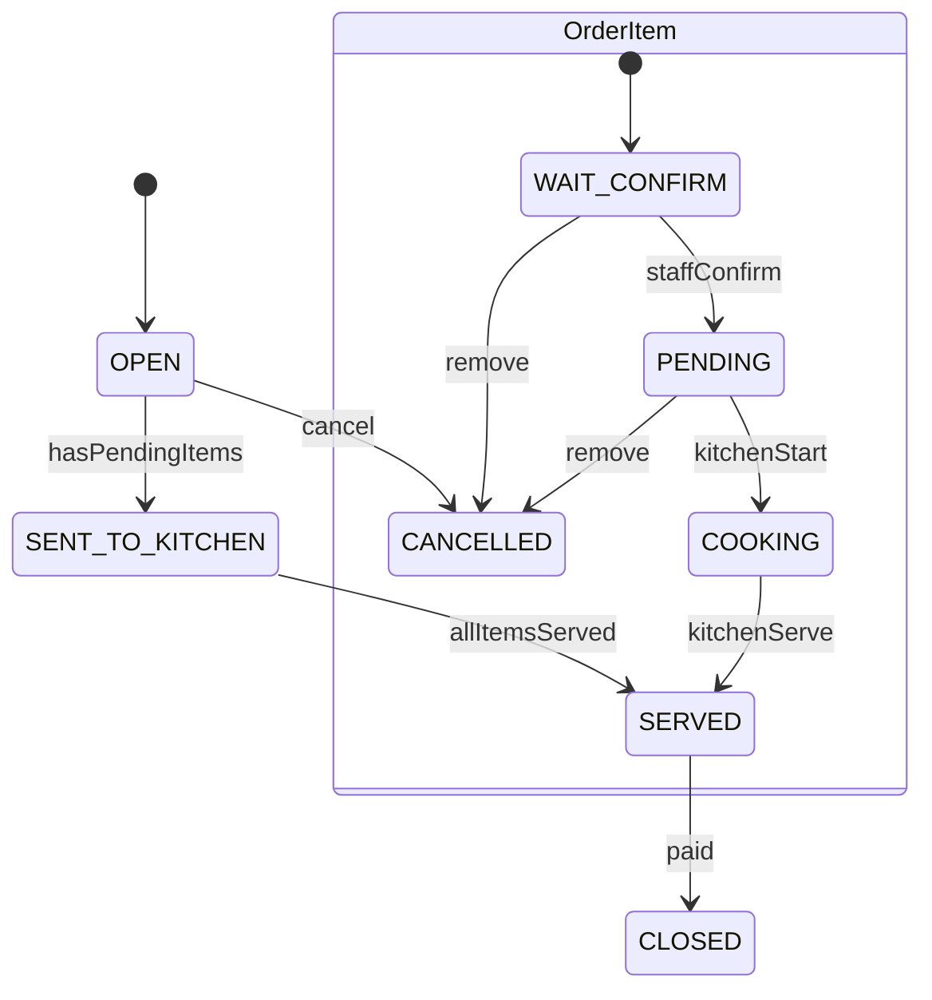

# Tái cấu trúc nghiệp vụ RMN theo vận hành nhà hàng thực tế (F&B)

> Mục tiêu của tài liệu này: **đồng bộ quy trình phần mềm với vận hành thực tế nhà hàng**, tránh mô hình “hư cấu” gây mâu thuẫn logic; đồng thời giải thích “**tại sao** sản phẩm tham chiếu làm như vậy” trước khi phê bình hoặc chỉnh kỹ thuật.

## 0) Tóm tắt vấn đề đang bị đánh giá

1. **Luồng Đặt bàn → Chọn món → Đặt cọc → Hoàn tất** đang tạo rào cản.
   - Khách đa số chỉ muốn “giữ chỗ” nhanh, không muốn chọn món/đặt cọc ngay.
   - Pre-order phù hợp một số mô hình (tiệc, set menu, nhà hàng đông/khung giờ cao điểm) nhưng không phải mặc định.

2. **Luồng “Check-in xong mới gán bàn” bị đánh giá bất khả thi**.
   - Ở sảnh giờ cao điểm, nếu đến lúc check-in mới quyết định bàn sẽ gây **ùn tắc**, dễ sai sót, khó kiểm soát bàn trống.
   - Thực tế: **host/reception** thường **gán/giữ bàn trước** (hoặc ít nhất “giữ chỗ theo khu vực/sức chứa”), khi khách đến chỉ xác nhận và dẫn vào bàn.

3. Tham khảo sản phẩm có sẵn nhưng áp dụng cho mô hình không tương thích dẫn đến “mâu thuẫn logic”.
   - Cần làm rõ mô hình tham chiếu: họ có **deposit policy**, **slot time**, **pre-order** vì họ tối ưu cho **no-show, năng lực bếp, tốc độ xoay bàn**, chứ không phải “cho vui”.

---

## 1) Nguyên tắc thiết kế nghiệp vụ (để khớp thực tế)

- **Mặc định tối giản:** đặt bàn chỉ cần ngày/giờ + số khách (hoặc số bàn) + liên hệ.
- **Tính linh hoạt theo tình huống:** deposit và pre-order là **tuỳ chọn / theo rule**, không ép tất cả.
- **Tách vai trò:** Host/Reception ≠ Waiter/Staff ≠ Cashier ≠ Kitchen.
- **Bàn là tài nguyên khan hiếm:** phải có cơ chế **hold/reserve trước** theo timeslot.
- **Bếp chỉ nhận món khi “được gửi”** (đã duyệt) để tránh spam/nhầm.

---

## 2) Vai trò thực tế (mapping vào hệ thống)

- **Khách (Customer):** đặt bàn, (tuỳ chọn) pre-order, (tuỳ chọn) đặt cọc.
- **Host/Reception (Staff/Manager):** xác nhận đặt bàn, **gán bàn trước**, xử lý đổi bàn, xử lý no-show.
- **Waiter/Staff:** mở order tại bàn, gọi món, duyệt món khách tự chọn.
- **Cashier:** checkout, áp mã giảm, in hoá đơn.
- **Kitchen:** nấu theo queue, cập nhật cooking/served.

---

## 3) Quy trình To‑Be đề xuất

### 3.1. Đặt bàn Online (mặc định KHÔNG pre-order, KHÔNG deposit)

**Mục tiêu:** giảm friction, tăng tỉ lệ đặt thành công.

1. Khách chọn: ngày/giờ, số khách (hoặc số bàn), liên hệ.
2. Reservation tạo ở trạng thái `PENDING`.
3. Host xác nhận → `CONFIRMED`.
4. Host **gán bàn trước** (hoặc gán “khu vực + sức chứa”) → bàn chuyển `RESERVED` theo timeslot.

> Khi khách đến: chỉ cần check-in nhanh, dẫn vào bàn đã giữ.

### 3.2. Deposit (chỉ khi cần) — “Xác nhận trước, yêu cầu cọc sau”

**Khi nào cần cọc?** (gợi ý rules; GVHD có thể chỉnh)

- Số khách lớn (ví dụ ≥ 6/8)
- Khung giờ cao điểm
- Lịch sử no-show của khách
- Nhà hàng có chính sách bắt buộc

**Luồng đề xuất**

- Host xác nhận reservation trước để khách yên tâm (`CONFIRMED`).
- Nếu cần cọc: chuyển nhãn/flag `depositRequired=true` và có `depositDeadlineAt`.
- Khách cọc trước deadline:
  - Payment thành công → `depositStatus=PAID`
  - Giữ bàn tiếp tục hiệu lực
- Quá deadline:
  - Tự động chuyển `CANCELLED` hoặc `NO_SHOW` (tuỳ chính sách) và **giải phóng bàn**.

> Lý do thực tế: cọc là công cụ chống no-show, không phải bước bắt buộc cho mọi booking.

### 3.3. Pre-order (tuỳ chọn) — chỉ cho mô hình phù hợp

**Khi nên pre-order:** tiệc/đoàn, set menu, món lâu, cần prep.

Luồng:

- Sau khi có `PENDING/CONFIRMED`, khách có thể thêm pre-order.
- Pre-order không nên block việc đặt bàn.
- Các món pre-order có thể vào order với trạng thái:
  - `PENDING` (nếu nhà hàng muốn bếp chuẩn bị trước giờ)
  - hoặc `WAIT_CONFIRM` (nếu cần staff duyệt để tránh khách đặt nhầm)

### 3.4. Walk‑in (khách vãng lai)

1. Host nhìn sơ đồ bàn → chọn bàn phù hợp.
2. Khi **ngồi vào bàn** mới mở order.
3. Bàn chuyển `OCCUPIED`, order `OPEN`.

> Điểm quan trọng: **bàn phải được chọn trước khi tạo order** (đỡ mâu thuẫn “order có mà bàn chưa có”).

### 3.5. Check‑in (khách đặt trước) — “gán bàn trước, check‑in chỉ xác nhận & seat”

**To‑Be:**

- Reservation đã có `tableIds` (hoặc allocation theo khu vực).
- Khi check-in:
  - set reservation → `CHECKED_IN`
  - set các bàn đã giữ → `OCCUPIED`
  - mở/activate order tương ứng → `OPEN`
  - chuyển hướng thẳng tới **chi tiết order / checkout** tuỳ vai trò

**Ngoại lệ thực tế cần hỗ trợ:**

- Khách đến sớm/muộn, bàn đã bị thay đổi → Host đổi bàn (re-assign) rồi check-in.

### 3.6. Gọi món và “báo bếp”

**Quy tắc vận hành:**

- Món mới gọi **không xuất hiện ở bếp** cho tới khi staff nhấn duyệt/gửi.

**Trạng thái món (OrderItem):**

- `WAIT_CONFIRM`: mới chọn / mới gọi, chờ duyệt
- `PENDING`: đã duyệt, vào queue bếp
- `COOKING`: bếp bắt đầu nấu
- `SERVED`: hoàn tất
- `CANCELLED`: huỷ (không tính tiền)

> Tại quầy/bàn: staff có nút “Duyệt” / “Duyệt tất cả” để chuyển `WAIT_CONFIRM → PENDING`.

### 3.7. Thanh toán (Checkout)

- Tạm tính = chỉ tính món không bị `CANCELLED`.
- VAT/discount áp dụng ở checkout.
- Trừ cọc (nếu có) ở bước thanh toán.
- Khi thanh toán xong:
  - order → `CLOSED`
  - bàn → `AVAILABLE`
  - reservation → `COMPLETED`

---

## 4) State machine đề xuất (để thống nhất logic)

### 4.1. Reservation

### 4.2. DiningTable

### 4.3. Order / OrderItem

---

## 5) “Vì sao sản phẩm tham chiếu làm như vậy?” (để nghiên cứu trước khi chỉnh)

- **Bắt chọn món trước:**
  - Mục tiêu: giảm thời gian tại bàn, giúp bếp chuẩn bị, tăng throughput.
  - Chỉ hợp lý nếu mô hình là “đặt trước + set menu” hoặc nhà hàng cực đông.

- **Bắt đặt cọc:**
  - Mục tiêu: giảm no-show, bảo vệ doanh thu.
  - Thực tế nhiều nơi chỉ yêu cầu cọc khi party lớn/giờ cao điểm.

- **Gán bàn muộn:**
  - Một số hệ thống chỉ “hold theo sức chứa/zone” để linh hoạt.
  - Nhưng trong vận hành sảnh, vẫn phải có thao tác **assign** (dù là soft-assign) trước giờ khách đến; UI nên hỗ trợ host làm việc đó sớm.

---

## 6) Lộ trình triển khai trong hệ thống hiện tại (không phá kiến trúc)

### Phase A — Chốt nghiệp vụ với GVHD (bắt buộc)

- Chốt mô hình nhà hàng: casual dining / fine dining / buffet / set menu.
- Chốt chính sách deposit: khi nào bắt buộc, deadline, hoàn/hủy.
- Chốt việc gán bàn: gán cố định theo tableIds hay gán theo zone/capacity.

### Phase B — Tối ưu luồng đặt bàn (giảm rào cản)

- Booking form:
  - Không ép pre-order.
  - Deposit: chỉ hiện khi rule yêu cầu (hoặc sau khi host confirm).

### Phase C — Sửa “check-in xong mới gán bàn”

- Thêm thao tác **Assign tables** ở màn quản lý reservation (host làm trước).
- Khi reservation `CONFIRMED` và có tableIds → set bàn `RESERVED`.
- Check-in chỉ xác nhận + chuyển trạng thái bàn `OCCUPIED`.

### Phase D — Chuẩn hoá “báo bếp”

- Item mới phải vào `WAIT_CONFIRM`.
- Bếp chỉ thấy `PENDING/COOKING` (hoặc order đã gửi bếp).

### Phase E — Tự động hoá vận hành

- No-show: grace period (ví dụ 15 phút) → `NO_SHOW`, giải phóng bàn.
- Cleanup cuối ngày: giải phóng bàn/order kẹt.

---

## 7) Checklist câu hỏi để làm việc với GVHD (đề xuất)

1. Mô hình nhà hàng hướng đến là gì? (casual/fine dining/buffet/tiệc)
2. Có bắt buộc deposit không? Nếu có:
   - ngưỡng party size/giờ cao điểm?
   - deadline cọc?
   - chính sách hoàn cọc/cancel?
3. Pre-order là bắt buộc hay tuỳ chọn?
4. Gán bàn:
   - gán cố định trước giờ?
   - hay hold theo zone/capacity, gán cụ thể sát giờ?
5. Check-in:
   - grace period bao lâu?
   - cần QR check-in hay staff check-in?
6. KPI vận hành muốn tối ưu: giảm no-show, tăng turnover, giảm waiting line?

---

## 8) Kết luận

- Để “thực tiễn”, hệ thống nên lấy **đặt bàn nhanh** làm mặc định, còn pre-order/deposit là “policy-driven optional”.
- Về vận hành: **gán bàn trước** (hoặc ít nhất hold seat/zone trước), check-in chỉ là xác nhận & dẫn khách.
- Trước khi chỉnh kỹ thuật, cần hiểu “**tại sao**” sản phẩm tham chiếu làm vậy để tránh chỉnh sai mô hình.
